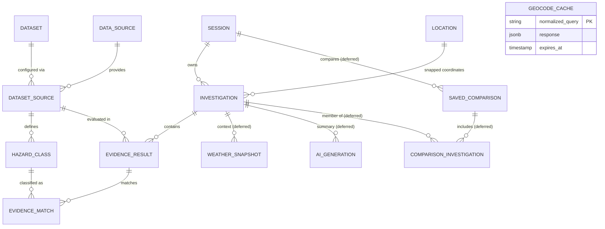

# HazardLens — Task-by-Task & Requirements Coverage Audit against SRS v3.1

**Document Version:** 2.6 (Authoritative Reconciled Audit)  
**Audit Date:** 9 October 2026  
**Audited Commit:** `main` at [`3a50439`](https://github.com/Thesis-Titans/hazardlens/commit/3a50439)  
**Repository Path:** [`docs/audits/task-and-requirements-audit.md`](docs/audits/task-and-requirements-audit.md)  
**Pull Request:** [PR #29](https://github.com/Thesis-Titans/hazardlens/pull/29) (open and unmerged; peer review requested from `@vincenttamano`)  
**Canonical Plan Reference:** Project Execution Plan §§3, 6, 7 ([docs/project-execution-plan.md](../project-execution-plan.md))  
**Document Status:** Reconciled working audit draft submitted for team review; formal baseline acceptance pending whole-team confirmation and Gate 0 closure.  
**Specification Reference:** System Requirements Specification v3.1 (working specification reference aligned with ISO/IEC/IEEE 29148:2018 principles; formal whole-team approval pending kickoff)  
**Governance Framework:** Section 8 Standard Issue Specification & Definition of Ready ([docs/agile-sprint-management-plan.md](../agile-sprint-management-plan.md))  
**Project Board:** [HazardLens — Sprint Board (Project #1)](https://github.com/orgs/Thesis-Titans/projects/1)  

---

## 1. Executive Evaluation & Evidential Framework

### Evidential Classifications
To eliminate ambiguity, every finding, record, and status metric in this audit is classified using strict evidential distinctions:

- **Reported:** A claim, log snippet, or metric recorded in tickets, PR summaries, or local developer workstations without independent reproduction attached. *Specifically, local `./scripts/verify.sh all` execution passes and CI run conclusions are classified as Reported until an independent clean-checkout reproduction is executed by a teammate and logged on [Issue #12](https://github.com/Thesis-Titans/hazardlens/issues/12).*
- **Observed:** A live configuration, file state, or record directly inspected in GitHub or the active repository tree. *Passing CI checks on GitHub Actions verify only that configured automated scripts executed without error on that commit; they do not validate requirements semantics or source accuracy.*
- **Verified:** A technical result reproduced hermetically through automated test suites or recorded test fixtures. For live external source queries, verification requires reproducible query records across sessions, offline mock/fixture replay, and recorded independent peer review (live source queries cannot themselves "pass offline"). *The presence of a test fixture file does not by itself verify upstream coverage boundaries or classification fidelity.*
- **Approved:** A technical, architectural, or scope decision formally confirmed by authorized team members (e.g. recorded kickoff meeting minutes, approved ADR, or formal gate closure).

### Requirements Evaluation Model
Rather than compressing multiple concepts into hybrid labels, requirements are audited across four separate, orthogonal dimensions:
1. **Specification:** Is the functional intent, boundary, and constraint documented without ambiguity? (`Specified` indicates documented requirement intent in SRS v3.1, not team approval / `Needs Clarification`)
2. **Implementation:** What code exists in `main`? (`Not Started` / `Scaffold Only` / `Preview Slice Only` / `Delivered`)
3. **Verification:** Does reproducible acceptance evidence pass? (`Pending` / `Partial` / `Verified` / `Not Applicable Yet`)
4. **Scope Decision:** What is the approved or proposed release placement? (`MVP-required (Working Direction)` remains strictly distinct from an approved release decision until confirmed at kickoff / `Proposed Post-MVP (Team Approval Pending)`)

### Working Baseline Assessment & Gate 0 Scope Boundary
> **Observed Assessment:** **Planning baseline substantially organized; final validation, whole-team confirmation, and Gate 0 closure pending.**
> 
> Standardized issue bodies and clean board configurations are valuable planning artifacts, but they do not prove that tasks are ready to execute or that the system is complete. Currently, only the FastAPI scaffold and the limited single-source MGB flood preview slice from PR #11 exist on `main`. Zero production multi-source orchestrators, PostGIS migrations, or final UI evidence components have been delivered.
> 
> **Explicit Scope Boundary During Gate 0:**
> - **Permitted Work:** Documentation corrections, issue specification refinements, planning and governance evidence collection, and peer reviews of documentation PRs (e.g. [PR #27](https://github.com/Thesis-Titans/hazardlens/pull/27) and [PR #29](https://github.com/Thesis-Titans/hazardlens/pull/29)) are actively permitted.
> - **Frozen Work:** Implementation of product features, hazard adapters, PostGIS migrations, and UI components remains **strictly paused** until Gate 0 ([Issue #12](https://github.com/Thesis-Titans/hazardlens/issues/12)) is formally closed with documented exit evidence.

---

## 2. Reconciled Governance & Tracking Actions

This version reflects the following confirmed repository and tracking reconciliations:

1. **Supporting Documentation PRs ([PR #27](https://github.com/Thesis-Titans/hazardlens/pull/27) & [PR #29](https://github.com/Thesis-Titans/hazardlens/pull/29)):**
   - **Observed:** Both PRs are **OPEN and unmerged**, based on `main` at `3a50439`, with peer reviews requested from `@vincenttamano`.
   - **Governance Role:** PR #27 (README scope alignment) and PR #29 (Task & requirements audit) serve as **useful supporting documentation alignments** that can be reviewed and merged during Gate 0. They do not constitute unilateral or unagreed additions to Issue #12's canonical exit criteria.
2. **Canonical Project Execution Plan (PEP) Alignment (Tasks T1–T18):**
   - **Canonical Source of Truth:** `docs/project-execution-plan.md` §§3, 6, 7 governs task breakdown and delegation. Tasks T1–T18 in the audit are aligned in 100% lockstep with PEP §6:
     - Tasks T5, T6, T7 mapped to [Issue #28](https://github.com/Thesis-Titans/hazardlens/issues/28) (Gate C).
     - Task T9 mapped to [Issue #1](https://github.com/Thesis-Titans/hazardlens/issues/1) (Schema ADR) and [Issue #13](https://github.com/Thesis-Titans/hazardlens/issues/13) (Session history & API persistence).
     - Task T10 mapped to [Issue #5](https://github.com/Thesis-Titans/hazardlens/issues/5) (Map viewer) and [Issue #7](https://github.com/Thesis-Titans/hazardlens/issues/7) (Place search & coordinate fallback).
     - Task T12 mapped to [Issue #17](https://github.com/Thesis-Titans/hazardlens/issues/17) (Rate limits & safe diagnostics).
     - Task T13 mapped to [Issue #8](https://github.com/Thesis-Titans/hazardlens/issues/8) (Evidence UI & limitations).
     - Task T14 mapped to [Issue #18](https://github.com/Thesis-Titans/hazardlens/issues/18) (Accessibility & browser matrix).
     - Task T15 mapped to [Issue #19](https://github.com/Thesis-Titans/hazardlens/issues/19) (NFR-09 extensibility).
     - Task T16 mapped to [Issue #12](https://github.com/Thesis-Titans/hazardlens/issues/12) (Gate 0 baseline) and [Issue #20](https://github.com/Thesis-Titans/hazardlens/issues/20) (Release verification).
     - Task T17 mapped to [Issue #4](https://github.com/Thesis-Titans/hazardlens/issues/4) (AI provider spike).
     - Task T18 mapped to [Issue #14](https://github.com/Thesis-Titans/hazardlens/issues/14) (Comparison/report) and [Issue #16](https://github.com/Thesis-Titans/hazardlens/issues/16) (Polygon area validation).
3. **Gate A Exit Criteria Aligned with Canonical PEP §3:**
   - **PEP §3 Definition:** Defines Gate A operational exit criteria strictly around Task T1 (MGB Flood first-source contract, repeatability, coverage rules, and offline fixtures in [Issue #2](https://github.com/Thesis-Titans/hazardlens/issues/2)). PEP §3 explicitly specifies that *"Persistence is not required for this first slice"* (Gate B).
   - **Operational Source Verification Exit Gate ([Issue #2](https://github.com/Thesis-Titans/hazardlens/issues/2)):** Formally satisfies Gate A's exit criteria and unblocks the stateless Gate B vertical slice ([Issue #3](https://github.com/Thesis-Titans/hazardlens/issues/3)).
   - **Database Architecture Foundation ([Issue #1](https://github.com/Thesis-Titans/hazardlens/issues/1)):** Initiated concurrently during Gate A to establish the reviewed schema ADR and clean container migration/rollback test. Scheduled for delivery under Gate D persistence (PEP Task T9 / Issue #13) without blocking the stateless in-memory vertical slice of Gate B.
4. **Working Baseline Dependency Wording in Issues #1 and #3:**
   - Reconciled dependency statements on live issues ([#1](https://github.com/Thesis-Titans/hazardlens/issues/1) and [#3](https://github.com/Thesis-Titans/hazardlens/issues/3)) to:
     `SRS v3.1 working baseline logical schema (docs/schema-reconciliation.md; formal whole-team confirmation pending Gate 0 kickoff)`.
5. **Issue #28 Full Standardization (Verification Evidence & Completion Rule):**
   - [Issue #28](https://github.com/Thesis-Titans/hazardlens/issues/28) updated to include explicit `## Verification Evidence` and `## Completion Rule` sections, fulfilling Section 8 standard issue requirements.
   - Verified live rendering of exact paths: `api/tests/fixtures/` and [`docs/source-verification-evidence-matrix.md`](https://github.com/Thesis-Titans/hazardlens/blob/main/docs/source-verification-evidence-matrix.md).
   - `gate-c` label description updated to *"Gate C — Remaining source contracts, orchestration & multi-source UI"* to encompass Issues #28, #6, and #8.
6. **Geocoding Working Proposal Language:**
   - Reconciled all geocoding provider mentions to "working proposal; final selection pending team approval" (Geoapify working proposal; public Nominatim fallback; Photon/PSGC exploratory).

---

## 3. Canonical Task Breakdown and Issue Traceability Matrix

### Canonical Task-to-Issue Traceability Matrix (PEP §§6, 7 Tasks T1–T18)

| Task | Canonical PEP Deliverable Scope | Depends On | Target Gate | Mapped Issue(s) & Delegation |
|:---:|---|:---:|:---:|---|
| **T1** | Verify first source (MGB Flood) and document live contract | Source selection | **Gate A** | **[#2](https://github.com/Thesis-Titans/hazardlens/issues/2)**<br>Lead: `@markalvincadangin` \| Reviewer: `@vincenttamano` |
| **T2** | Finalize first-slice API and evidence response contract | T1 | **Gate B** | **[#3](https://github.com/Thesis-Titans/hazardlens/issues/3)**<br>Lead: `@markalvincadangin` \| Reviewer: `@vincenttamano` |
| **T3** | Implement first investigation endpoint and evidence UI | T2 | **Gate B** | **[#3](https://github.com/Thesis-Titans/hazardlens/issues/3)**<br>Subtask T3.1 (API): Lead `@vincenttamano` \| Reviewer `@markalvincadangin`<br>Subtask T3.2 (UI): Lead `@Lovelly143` \| Reviewer `@faithbn` |
| **T4** | Implement deterministic explanations and honest empty states | T2–T3 | **Gate B** | **[#3](https://github.com/Thesis-Titans/hazardlens/issues/3)**<br>Lead: `@vincenttamano` \| Reviewer: `@markalvincadangin` |
| **T5** | Verify MGB rain-induced landslide source | T1 procedure | **Gate C** | **[#28](https://github.com/Thesis-Titans/hazardlens/issues/28)**<br>Lead: `@markalvincadangin` \| Reviewer: `@vincenttamano` |
| **T6** | Verify PHIVOLCS liquefaction source | T1 procedure | **Gate C** | **[#28](https://github.com/Thesis-Titans/hazardlens/issues/28)**<br>Lead: `@vincenttamano` \| Reviewer: `@markalvincadangin` |
| **T7** | Verify PHIVOLCS active-fault source | T1 procedure | **Gate C** | **[#28](https://github.com/Thesis-Titans/hazardlens/issues/28)**<br>Lead: `@Justin-Ardena` \| Reviewer: `@markalvincadangin` |
| **T8** | Integrate four verified sources through normal orchestration | T1, T5–T7, T2 | **Gate C** | **[#6](https://github.com/Thesis-Titans/hazardlens/issues/6)**<br>Lead: `@vincenttamano` \| Reviewer: `@markalvincadangin` |
| **T9** | Implement required persistence and anonymous session history | Logical schema review | **Gate D** | **[#1](https://github.com/Thesis-Titans/hazardlens/issues/1)** (Schema ADR & migration boundary)<br>**[#13](https://github.com/Thesis-Titans/hazardlens/issues/13)** (Session history & API persistence)<br>Lead: `@vincenttamano` \| Reviewer: `@markalvincadangin` |
| **T10** | Implement full location workflow (Search + Map fallback) | T2–T3, provider decision | **Gate D** | **[#5](https://github.com/Thesis-Titans/hazardlens/issues/5)** (MapLibre viewer; Lead `@Justin-Ardena` \| Reviewer `@Lovelly143`)<br>**[#7](https://github.com/Thesis-Titans/hazardlens/issues/7)** (Place search; Lead `@markalvincadangin` \| Reviewer `@vincenttamano`) |
| **T11** | Add independent weather context | Core investigation API | **Gate D** | **[#15](https://github.com/Thesis-Titans/hazardlens/issues/15)**<br>Lead: `@markalvincadangin` / `@Lovelly143` \| Reviewer: `@vincenttamano` |
| **T12** | Implement API rate limits and privacy-safe diagnostics | API contracts | **Gate D** | **[#17](https://github.com/Thesis-Titans/hazardlens/issues/17)**<br>Lead: `@vincenttamano` \| Reviewer: `@markalvincadangin` |
| **T13** | Complete evidence provenance, attribution, and disclaimers | Evidence UI & contracts | **Gate D** | **[#8](https://github.com/Thesis-Titans/hazardlens/issues/8)**<br>Lead: `@Lovelly143` \| Reviewer: `@faithbn` |
| **T14** | Complete accessibility and supported-browser acceptance | Main MVP workflows | **Gate D** | **[#18](https://github.com/Thesis-Titans/hazardlens/issues/18)**<br>Lead: `@faithbn` \| Reviewer: `@Lovelly143` |
| **T15** | Demonstrate compatible-source extensibility (NFR-09) | T8 orchestration | **Gate D** | **[#19](https://github.com/Thesis-Titans/hazardlens/issues/19)**<br>Lead: `@markalvincadangin` \| Reviewer: `@vincenttamano` |
| **T16** | Complete MVP release verification and readiness gates | T1–T15 | **Gate E** | **[#12](https://github.com/Thesis-Titans/hazardlens/issues/12)** (Gate 0 governance baseline)<br>**[#20](https://github.com/Thesis-Titans/hazardlens/issues/20)** (Gate E clean-checkout verification)<br>Leads: `@faithbn` & `@markalvincadangin` \| Reviewers: `@vincenttamano` & `@Lovelly143` |
| **T17** | Begin gated AI implementation spike (if approved for release) | Gates B & C passing | **Post-MVP** | **[#4](https://github.com/Thesis-Titans/hazardlens/issues/4)**<br>Lead: `@markalvincadangin` \| Reviewer: `@vincenttamano` |
| **T18** | Implement comparison, printable report & polygon investigation | Explicit post-MVP planning | **Post-MVP** | **[#14](https://github.com/Thesis-Titans/hazardlens/issues/14)** (Comparison & printable report)<br>**[#16](https://github.com/Thesis-Titans/hazardlens/issues/16)** (Polygon area validation)<br>Leads: `@Lovelly143` / `@Justin-Ardena` \| Reviewers: `@faithbn` / `@vincenttamano` |

---

### Audit of 18 Active Delivery and Governance Issues

*Selection Rule: This table audits 100% of the active issues in the repository (18 of 18 open issues in `Thesis-Titans/hazardlens`).*

| Issue | Standardized Title | Gate & Prov. Sprint | Mapped PEP Tasks & SRS Reqs | Proposed Delegation (Kickoff Confirmation Pending) | Issue Dependency & Readiness Status | Outstanding Refinements & Exit Criteria |
|:---:|---|:---:|---|---|:---:|---|
| **[#12](https://github.com/Thesis-Titans/hazardlens/issues/12)** | `[Gate 0] Close planning, governance, and delegation baseline` | **Gate 0**<br>Sprint 1 | Task T16 (Gov)<br>Governance, NFR-11 | Lead: `@markalvincadangin`<br>Review: `@vincenttamano` | **Gate 0 Active**<br>(Blocks all downstream gates) | • Hold kickoff meeting to agree on sprint cadence, capacity, and roles.<br>• Confirm 2 pending organization invitations (`@Justin-Ardena` + 1).<br>• Verify live branch protection rules with GitHub administrator.<br>• Record clean-checkout reproduction by an independent teammate. |
| **[#1](https://github.com/Thesis-Titans/hazardlens/issues/1)** | `[Gate A] Review logical schema and define MVP PostGIS migration boundary` | **Gate A**<br>Sprint 1 | Task T9 (Schema)<br>SRS §4.6, NFR-10, NFR-12 | Lead: `@vincenttamano`<br>Review: `@markalvincadangin` | **Gate A Staged**<br>(Blocked by Gate 0; dependency on SRS working baseline) | • Produce technical ADR documenting physical table types, constraints, and cascading rules for all 14 SRS entities.<br>• Restrict initial Alembic migration to core MVP tables (9 tables), deferring comparison, weather, geocode, and AI tables.<br>• Automated upgrade/downgrade test on clean PostGIS container. |
| **[#2](https://github.com/Thesis-Titans/hazardlens/issues/2)** | `[Gate A] Verify MGB Flood hazard source contract and repeatability (Task T1)` | **Gate A**<br>Sprint 1 | Task T1<br>SRS §3, §7, FR-05, FR-06, NFR-02, NFR-07 | Lead: `@markalvincadangin`<br>Review: `@vincenttamano` | **Gate A Staged**<br>(Blocked by Gate 0) | • Capture fresh live-query evidence across independent sessions for MGB Flood.<br>• Establish source-supported coverage rule; unverified areas must return `UNAVAILABLE` rather than `NO_EVIDENCE`.<br>• Commit sanitized offline fixtures. Acceptance formally satisfies PEP Gate A and unblocks Gate B. |
| **[#3](https://github.com/Thesis-Titans/hazardlens/issues/3)** | `[Gate B] First vertical slice: investigation API and evidence card UI` | **Gate B**<br>Sprint 1 | Tasks T2, T3, T4<br>FR-01, FR-03, FR-04, FR-07, FR-10, NFR-01 | T2: `@markalvin...` / `@vincent...`<br>T3.1 API: `@vincent...` / `@markalvin...`<br>T3.2 UI: `@Lovelly143` / `@faithbn`<br>T4 Logic: `@vincent...` / `@markalvin...` | **Gate B Staged**<br>(Blocked by Gate A / #2; dependency on SRS working baseline) | • Depends on verified MGB flood contract from #2.<br>• Coordinate input to rendered card workflow tested end-to-end.<br>• Enforce deterministic explanation algorithm without LLM dependency (T4).<br>• Persistence explicitly excluded from this first slice per PEP §3. |
| **[#28](https://github.com/Thesis-Titans/hazardlens/issues/28)** | `[Gate C] Verify remaining three official hazard sources (Tasks T5, T6, T7)` | **Gate C**<br>Sprint 2 | Tasks T5, T6, T7<br>SRS §3, §7, FR-05, FR-06, NFR-02, NFR-07 | T5: `@markalvincadangin`<br>T6: `@vincenttamano`<br>T7: `@Justin-Ardena` | **Gate C Staged**<br>(Blocked by Gate 0 / #2; independent of #3 UI) | • Capture live query records and repeatability for MGB Landslide, PHIVOLCS Liquefaction, and Active Faults.<br>• Document active fault proximity buffer operations and distance semantics.<br>• Commit offline fixtures for all 3 layers. All Section 8 sections fully standardized. Unblocks #6. |
| **[#6](https://github.com/Thesis-Titans/hazardlens/issues/6)** | `[Gate C] Integrate verified official hazard data sources into orchestrator` | **Gate C**<br>Sprint 2 | Task T8<br>FR-03, FR-05, FR-06, FR-09, NFR-01, NFR-02, NFR-03, NFR-09 | Lead: `@vincenttamano`<br>Review: `@markalvincadangin` | **Gate C Staged**<br>(Blocked by Gate B / #3 & #28) | • Concurrent query orchestrator under SRS default 10-second bounded deadline.<br>• Verify one source outage does not suppress findings from others.<br>• Preserve multiple matching features and differing source classifications verbatim. |
| **[#8](https://github.com/Thesis-Titans/hazardlens/issues/8)** | `[Gate C] Evidence card UI with official classifications and limitation notes` | **Gate C**<br>Sprint 2 | Task T13<br>FR-04, FR-07, FR-08, FR-14, NFR-08 | Lead: `@Lovelly143`<br>Review: `@faithbn` | **Gate C Staged**<br>(Blocked by Gate B / #3) | • Render exact published classifications without synthetic risk scores.<br>• Distinct visual badges for all 5 statuses (`FOUND`, `NO_EVIDENCE`, `OUTSIDE_COVERAGE`, `UNAVAILABLE`, `UNSUPPORTED`).<br>• Visibly distinguish recorded fixtures from live results. |
| **[#5](https://github.com/Thesis-Titans/hazardlens/issues/5)** | `[Gate D] Interactive map viewer and coordinate picker fallback` | **Gate D**<br>Sprint 2 | Task T10 (Map)<br>FR-01, FR-02, FR-14, NFR-06 | Lead: `@Justin-Ardena`<br>Review: `@Lovelly143` | **Gate D Staged**<br>(Blocked by Gate B / #3) | • MapLibre canvas with pin-drop coordinate selection.<br>• Resilient fallback: evidence panel renders even if map tiles fail to load (FR-14).<br>• Confirm Justin's organization invitation is accepted. |
| **[#7](https://github.com/Thesis-Titans/hazardlens/issues/7)** | `[Gate D] Philippine place search with coordinate fallback` | **Gate D**<br>Sprint 2 | Task T10 (Search)<br>FR-01, FR-03, NFR-06 | Lead: `@markalvincadangin`<br>Review: `@vincenttamano` | **Gate D Staged**<br>(Blocked by Gate B / #3) | • Finalize geocoding provider selection (Geoapify working proposal awaiting team approval; public Nominatim fallback; Photon/PSGC exploratory).<br>• Enforce no client-side autocomplete policy.<br>• Seamless fallback to manual coordinates on geocoder error/timeout. |
| **[#13](https://github.com/Thesis-Titans/hazardlens/issues/13)** | `[Gate D] Investigation history and anonymous session persistence` | **Gate D**<br>Sprint 3 | Task T9 (Persistence)<br>FR-02, NFR-05, NFR-12, NFR-18 | Lead: `@vincenttamano`<br>Review: `@markalvincadangin` | **Gate D Staged**<br>(Blocked by Gate A & B) | • Cryptographically random HttpOnly cookie (SameSite=Lax).<br>• Strict cross-session isolation test (returns 404 on mismatched session ID).<br>• Zero raw client IPs stored or logged; 30-day expiry enforcement. |
| **[#15](https://github.com/Thesis-Titans/hazardlens/issues/15)** | `[Gate D] Weather card with independent failure isolation` | **Gate D**<br>Sprint 3 | Task T11<br>FR-13, FR-21 | Lead: `@markalvin...` / `@Lovelly...`<br>Review: `@vincenttamano` | **Gate D Staged**<br>(Blocked by Gate B / #3) | • Proposed engineering target timeout for Open-Meteo query.<br>• Strict failure isolation: weather failure returns `UNAVAILABLE` without delaying or modifying hazard evidence (FR-21). |
| **[#17](https://github.com/Thesis-Titans/hazardlens/issues/17)** | `[Gate D] API rate limits and privacy-safe request diagnostics` | **Gate D**<br>Sprint 3 | Task T12<br>NFR-04, NFR-13, NFR-18 | Lead: `@vincenttamano`<br>Review: `@markalvincadangin` | **Gate D Staged**<br>(Blocked by Gate C / #6) | • Rate limiting middleware returning HTTP 429 and `Retry-After`.<br>• Structured JSON diagnostics omitting secrets, live tokens, and raw IP addresses.<br>• Restrictive CORS configuration validated for deployment. |
| **[#18](https://github.com/Thesis-Titans/hazardlens/issues/18)** | `[Gate D] Accessibility and supported-browser acceptance checks` | **Gate D**<br>Sprint 3 | Task T14<br>NFR-16, NFR-17 | Lead: `@faithbn`<br>Review: `@Lovelly143` | **Gate D Staged**<br>(Blocked by Gate D UI) | • Keyboard navigation audit without focus traps.<br>• ARIA live regions for async evidence loading; WCAG 2.2 AA contrast checks.<br>• Responsive testing on Chrome, Firefox, Edge, and mobile viewports. |
| **[#19](https://github.com/Thesis-Titans/hazardlens/issues/19)** | `[Gate D] Clarify NFR-09 dataset extensibility as a measurable requirement` | **Gate D**<br>Sprint 3 | Task T15<br>NFR-09 | Lead: `@markalvincadangin`<br>Review: `@vincenttamano` | **Gate D Staged**<br>(Blocked by Gate C / #6) | • Register mock compatible dataset via adapter class + registry row.<br>• Execute query through normal orchestrator asserting normalized output without requiring an Alembic migration. |
| **[#20](https://github.com/Thesis-Titans/hazardlens/issues/20)** | `[Gate E] Reproduce clean-checkout setup and verify repository rules` | **Gate E**<br>Sprint 3 | Task T16 (Release)<br>Gate E, NFR-10, §7 | Lead: `@faithbn` / `@markalvin...`<br>Review: `@vincent...` / `@Lovelly...` | **Gate E Staged**<br>(Blocked by all MVP Tasks) | • Teammate clean clone reproduction, Docker Compose startup, `./scripts/verify.sh all` execution, and terminal logging.<br>• Requirements traceability matrix links verified evidence to all MVP requirements. |
| **[#4](https://github.com/Thesis-Titans/hazardlens/issues/4)** | `[Post-MVP] AI provider evaluation and tool-calling spike` | **Post-MVP**<br>Sprint 4 | Task T17<br>FR-15–FR-19, NFR-14, NFR-15 | Lead: `@markalvincadangin`<br>Review: `@vincenttamano` | **Deferred**<br>(Proposed Post-MVP; gated behind core evidence) | • Strictly gated behind Gates B and C.<br>• Pydantic schema validation for structured outputs; bounded tool allow-list (max 5 calls); deterministic fallback on timeout/failure. |
| **[#14](https://github.com/Thesis-Titans/hazardlens/issues/14)** | `[Post-MVP] Investigation comparison and printable evidence report` | **Post-MVP**<br>Sprint 4 | Task T18 (Compare/Report)<br>FR-11, FR-12 | Lead: `@Lovelly143` / `@faithbn`<br>Review: `@markalvincadangin` | **Deferred**<br>(Proposed Post-MVP) | • Side-by-side comparison without universal scoring.<br>• Print layout (`@media print`) with official attribution, watermarking, and source dates. Does not block MVP. |
| **[#16](https://github.com/Thesis-Titans/hazardlens/issues/16)** | `[Post-MVP] Area investigation polygon validation and source capability gates` | **Post-MVP**<br>Sprint 4 | Task T18 (Polygon)<br>FR-20 | Lead: `@markalvincadangin`<br>Review: `@vincenttamano` | **Deferred**<br>(Proposed Post-MVP) | • Geometry validation for simple convex/concave polygons; rejects self-intersecting or oversized geometries; returns `UNSUPPORTED` for point-only layers. |

---

## 4. Multi-Column Requirements Coverage Audit against SRS v3.1

### Functional Requirements (FR-01 to FR-21)

| Requirement | Short Intent | Specification | Implementation | Verification | Scope Decision |
|---|---|:---:|:---:|:---:|---|
| **FR-01** | Location selection via search or map; coordinate rounding | Specified | Preview slice only (rounds coordinates) | Pending (place search & map tests outstanding) | MVP-required (Working Direction) |
| **FR-02** | Investigation persistence and session history | Specified | Not started | Pending (PostGIS migration & history tests outstanding) | MVP-required (Working Direction) |
| **FR-03** | Concurrent multi-dataset query under 10s deadline | Specified | Preview slice only (single source) | Pending (concurrent orchestrator & timeout tests outstanding) | MVP-required (Working Direction) |
| **FR-04** | Every evidence result uses exactly one of five statuses | Specified | Preview slice only (schema defines 5 statuses) | Partial (flood preview verified; multi-source tests pending) | MVP-required (Working Direction) |
| **FR-05** | `NO_EVIDENCE` only after query inside verified coverage | Specified | Preview slice only (empty maps to `UNAVAILABLE`) | Partial (flood offshore fixture captured; coverage rules pending) | MVP-required (Working Direction) |
| **FR-06** | Geometry-appropriate spatial operations (point, fault distance) | Specified | Preview slice only (point-in-polygon) | Pending (active fault buffer & distance tests outstanding) | MVP-required (Working Direction) |
| **FR-07** | Provenance display: agency, layer, source date, retrieval time | Specified | Preview slice only (provenance metadata fields) | Partial (preview schema verified; UI metadata display pending) | MVP-required (Working Direction) |
| **FR-08** | Preserve published classifications verbatim; no universal score | Specified | Preview slice only (preserves MGB labels) | Partial (preview asserts source labels; UI score absence pending) | MVP-required (Working Direction) |
| **FR-09** | Preserve multiple material matches and display disagreements | Specified | Preview slice only (feature list supported) | Pending (multi-hazard intersection test outstanding) | MVP-required (Working Direction) |
| **FR-10** | Deterministic plain-language explanation without LLM | Specified | Preview slice only (summary field) | Partial (rule-based algorithm specified; full dictionary test pending) | MVP-required (Working Direction) |
| **FR-11** | Side-by-side comparison of past investigations | Specified | Not started | Not applicable yet | Proposed Post-MVP (Team Approval Pending) |
| **FR-12** | Printable hazard briefing summary with watermarking | Specified | Not started | Not applicable yet | Proposed Post-MVP (Team Approval Pending) |
| **FR-13** | Current weather card separate from hazard evidence | Specified | Not started | Pending (Open-Meteo adapter & UI card tests outstanding) | MVP-required (Working Direction) |
| **FR-14** | Evidence panel functions if map tiles or geocoder fail | Specified | Not started | Pending (graceful degradation offline UI test outstanding) | MVP-required (Working Direction) |
| **FR-15** | AI explanation consumes only structured evidence | Specified | Not started | Not applicable yet (gated behind core evidence) | Proposed Post-MVP (Team Approval Pending) |
| **FR-16** | AI chat grounded in current investigation; refuses unsupported queries | Specified | Not started | Not applicable yet (gated behind core evidence) | Proposed Post-MVP (Team Approval Pending) |
| **FR-17** | Natural-language lookup bounded by allow-listed tool calls (max 5) | Specified | Not started | Not applicable yet (gated behind core evidence) | Proposed Post-MVP (Team Approval Pending) |
| **FR-18** | Visual "AI Generated" badge; store model, prompt version, hash | Specified | Not started | Not applicable yet (gated behind core evidence) | Proposed Post-MVP (Team Approval Pending) |
| **FR-19** | AI provider failure falls back seamlessly to deterministic summary | Specified | Not started | Not applicable yet (gated behind core evidence) | Proposed Post-MVP (Team Approval Pending) |
| **FR-20** | Simple area polygon validation with configurable size limit | Specified | Not started | Not applicable yet | Proposed Post-MVP (Team Approval Pending) |
| **FR-21** | Weather failure returns `UNAVAILABLE` without impacting hazard results | Specified | Not started | Pending (weather 500 error mock isolation test outstanding) | MVP-required (Working Direction) |

---

### Non-Functional Requirements (NFR-01 to NFR-18)

| Requirement | Short Intent | Specification | Implementation | Verification | Scope Decision |
|---|---|:---:|:---:|:---:|---|
| **NFR-01** | Cached lookup < 1s; live query bounded by deadline | Specified | Preview slice only (bounded timeout) | Pending (latency benchmark test outstanding) | MVP-required (Working Direction) |
| **NFR-02** | Upstream timeout + 1 retry on 5xx/timeout; no retry on 4xx | Specified | Preview slice only (retry transport in preview client) | Partial (flood preview verified; remaining 3 sources pending) | MVP-required (Working Direction) |
| **NFR-03** | Upstream URLs from server configuration; no client-supplied URLs | Specified | Preview slice only (configured in adapter) | Partial (flood preview verified; remaining adapters pending) | MVP-required (Working Direction) |
| **NFR-04** | Restrictive CORS; AI API keys remain server-side | Specified | Scaffold only (middleware in `main.py`) | Partial (local CORS passes; production origin audit pending) | MVP-required (Working Direction) |
| **NFR-05** | Cryptographically random HttpOnly cookie; zero raw client IPs | Specified | Not started | Pending (cookie entropy & log audit tests outstanding) | MVP-required (Working Direction) |
| **NFR-06** | Geocoding policy compliance; no public Nominatim autocomplete | Specified | Not started | Pending (explicit search submission test outstanding) | MVP-required (Working Direction) |
| **NFR-07** | Recorded demo fixtures for Iloilo points; labelled as recorded | Specified | Preview slice only (2 flood fixtures committed) | Partial (flood fixtures verified; remaining 3 sources pending) | MVP-required (Working Direction) |
| **NFR-08** | Attribution and planning-data disclaimer banner on every page | Specified | Scaffold only (banner draft) | Pending (UI inspection across all pages outstanding) | MVP-required (Working Direction) |
| **NFR-09** | Compatible dataset extensible via adapter + registry row without migration | Specified | Not started | Pending (mock adapter registration test outstanding) | MVP-required (Working Direction) |
| **NFR-10** | Hermetic dependency pinning; shared API contracts | Specified | Scaffold only (pinned in lockfiles) | Partial (lockfiles pass verify.sh; TypeScript export pending) | MVP-required (Working Direction) |
| **NFR-11** | Strictly no scraping, framing, or embedding of HazardHunterPH | Specified | Scaffold only (policy codified in `AGENTS.md`) | Partial (codified in AGENTS.md; reproducible grep test & independent review pending) | MVP-required (Working Direction) |
| **NFR-12** | Strict cross-session isolation; cannot access others' investigations | Specified | Not started | Pending (cross-session 404 security test outstanding) | MVP-required (Working Direction) |
| **NFR-13** | Rate limits on expensive endpoints; HTTP 429 on exhaustion | Specified | Not started | Pending (burst request rate-limit test outstanding) | MVP-required (Working Direction) |
| **NFR-14** | AI timeouts and fallback on transport/model error | Specified | Not started | Not applicable yet (gated behind core evidence) | Proposed Post-MVP (Team Approval Pending) |
| **NFR-15** | Prompt injection defenses; source attributes treated as untrusted | Specified | Not started | Not applicable yet (gated behind core evidence) | Proposed Post-MVP (Team Approval Pending) |
| **NFR-16** | WCAG 2.2 AA accessibility; keyboard-only navigation; no focus traps | Specified | Not started | Pending (Axe-core scan & keyboard audit log outstanding) | MVP-required (Working Direction) |
| **NFR-17** | Cross-browser support (Chrome, Firefox, Edge) and mobile viewports | Specified | Not started | Pending (responsive screenshot captures outstanding) | MVP-required (Working Direction) |
| **NFR-18** | Structured diagnostic logs omitting raw IPs and secrets | Specified | Not started | Pending (log regex audit for IPs and tokens outstanding) | MVP-required (Working Direction) |

---

## 5. Authoritative 14-Entity Schema Inventory and Migration Boundary

### Reconciliation against SRS §4.6
The data architecture inventory consists of **exactly 14 relational entities** defined in SRS §4.6. To prevent premature schema dead ends or empty migrations, physical migration is staged into core MVP and deferred boundaries:

| Entity | SRS §4.6 Definition & Key Columns | Boundary Placement | Tracking Issue | Mapped PEP Task |
|---|---|:---:|:---:|:---:|
| `dataset` | Canonical hazard themes (`key`, `name`, `description`) | **Initial Core MVP** | [#1](https://github.com/Thesis-Titans/hazardlens/issues/1) | Task T9 |
| `data_source` | Agency registry (`agency`, `attribution`, `terms_url`) | **Initial Core MVP** | [#1](https://github.com/Thesis-Titans/hazardlens/issues/1) | Task T9 |
| `dataset_source` | Specific endpoint/layer (`dataset`, `source`, `layer`, `extent`, `active`) | **Initial Core MVP** | [#1](https://github.com/Thesis-Titans/hazardlens/issues/1) | Task T9 |
| `hazard_class` | Source published classifications (`code`, `label`, `definition_text`) | **Initial Core MVP** | [#1](https://github.com/Thesis-Titans/hazardlens/issues/1) | Task T9 |
| `location` | Snapped point geography coordinates (EPSG:4326) | **Initial Core MVP** | [#1](https://github.com/Thesis-Titans/hazardlens/issues/1) | Task T9 |
| `session` | Anonymous session identifier (`id`, `created_at`, `expires_at`) | **Initial Core MVP** | [#1](https://github.com/Thesis-Titans/hazardlens/issues/1) | Task T9 |
| `investigation` | Query record (`session`, `selection_type`, `geometry`, `duration_ms`) | **Initial Core MVP** | [#1](https://github.com/Thesis-Titans/hazardlens/issues/1) | Task T9 |
| `evidence_result` | Per-source evaluation (`status`, `retrieved_at`, `latency_ms`, `raw`) | **Initial Core MVP** | [#1](https://github.com/Thesis-Titans/hazardlens/issues/1) | Task T9 |
| `evidence_match` | Feature matches linking result to hazard class (`distance_band_m`) | **Initial Core MVP** | [#1](https://github.com/Thesis-Titans/hazardlens/issues/1) | Task T9 |
| `weather_snapshot` | Investigation context (`temperature`, `humidity`, `precipitation`) | **Deferred (Gate D)** | [#15](https://github.com/Thesis-Titans/hazardlens/issues/15) | Task T11 |
| `geocode_cache` | Place query cache (`normalized_query`, `response`, `expires_at`) | **Deferred (Gate D)** | [#7](https://github.com/Thesis-Titans/hazardlens/issues/7) | Task T10 |
| `saved_comparison` | Session comparisons (`session`, `name`, `created_at`) | **Deferred (Post-MVP)** | [#14](https://github.com/Thesis-Titans/hazardlens/issues/14) | Task T18 |
| `comparison_investigation`| Comparison join table (`comparison`, `investigation`, `position`) | **Deferred (Post-MVP)** | [#14](https://github.com/Thesis-Titans/hazardlens/issues/14) | Task T18 |
| `ai_generation` | Investigation AI summaries (`kind`, `model`, `evidence_hash`) | **Deferred (Post-MVP)** | [#4](https://github.com/Thesis-Titans/hazardlens/issues/4) | Task T17 |

*(Note on Area Polygons: SRS §4.6 explicitly stores polygon selections directly in `investigation.geometry` with `selection_type = 'AREA'`. There is NO separate `polygon_investigations` table in the 14-entity SRS inventory; area polygon validation in Issue [#16](https://github.com/Thesis-Titans/hazardlens/issues/16) operates directly on the canonical `investigation` table).*



*(Note: `GEOCODE_CACHE` is an independent query cache table without foreign-key dependencies to `session` or `investigation`; its records expire after 30 days under NFR-06).*

### Schema Authority Status
- The 9-table boundary is a **working engineering proposal** documented in `docs/schema-reconciliation.md` and [Issue #1](https://github.com/Thesis-Titans/hazardlens/issues/1).
- Exact SQL types, spatial SRID constraints, composite indexes, cascading rules, and physical migration scripts remain **pending the schema ADR, independent review, and automated migration tests**.
- No physical migration is described as delivered until the migration scripts exist in `api/alembic/versions/`, execute cleanly against PostGIS, and have been verified via automated test suites.

---

## 6. Actionable Gate 0 Closure Alignment (Issue #12)

Gate 0 must not be closed on assumptions or informal PR merges. Closure of Gate 0 is governed strictly by the **canonical acceptance criteria of [Issue #12](https://github.com/Thesis-Titans/hazardlens/issues/12)**:

- [ ] **1. Dependency-Ordered Gate Model Established:**  
  Execution plan confirms dependency-ordered Gates (Gate 0 through Gate E) with no arbitrary calendar due dates.
- [ ] **2. Whole-Team Kickoff Meeting Conducted & Minutes Recorded:**  
  Whole team (`@markalvincadangin`, `@vincenttamano`, `@Lovelly143`, `@faithbn`, `@Justin-Ardena`) confirms:
  - Sprint cadence, actual student capacity, Definition of Done, and distinct reviewer pairings.
  - Scope classifications (FR-11, FR-12, FR-20 deferred; FR-13, FR-21 in MVP; AI layer gated behind core evidence).
  - Geocoding working proposal (Geoapify working proposal; public Nominatim fallback; DEC-20).
- [ ] **3. Task Delegation & Reviewer Distinctness Established:**  
  All 18 delivery tasks (T1–T18) have designated lead implementers and distinct independent reviewers (`Author != Reviewer`).
- [ ] **4. Active Backlog Issues Standardized:**  
  All 18 active delivery and governance issues conform to the Section 8 standard issue specification (Purpose, Scope, Dependencies, Delegation, Acceptance Criteria, Verification Evidence, Completion Rule). *Fully verified on live issues including [Issue #28](https://github.com/Thesis-Titans/hazardlens/issues/28).*
- [ ] **5. Organization Invitations Settled on Live Roster:**  
  Confirm `@Justin-Ardena` and the remaining collaborator accept write invitations on `Thesis-Titans`. Verify live organization roster and invitation list.
- [ ] **6. Clean-Checkout Reproduction of AGENTS.md Verification Commands:**  
  An independent teammate (e.g. `@vincenttamano` or `@faithbn`) clones fresh from `main`, executes the exact verification commands, and logs execution evidence on Issue [#12](https://github.com/Thesis-Titans/hazardlens/issues/12):
  - Backend: `ruff check .`, `ruff format --check .`, `pytest`
  - Frontend: `npm run lint`, `npx tsc --noEmit`, `npm run build`  
  *(Note: `./scripts/verify.sh all` executes these exact 6 phases hermetically; execution must be independently reproduced on a clean checkout).*
- [ ] **7. Strict Feature Freeze Maintained:**  
  No product feature implementation code is merged or executed until Issue [#12](https://github.com/Thesis-Titans/hazardlens/issues/12) is formally signed off by `@vincenttamano` and closed.

*(Supporting Documentation PRs: Merging [PR #27](https://github.com/Thesis-Titans/hazardlens/pull/27) and [PR #29](https://github.com/Thesis-Titans/hazardlens/pull/29) aligns documentation with the working baseline during Gate 0, but does not alter Issue #12's exit criteria).*

---

## 7. Immediate Execution Sequence Upon Gate 0 Closure

```text
[ Gate 0 Formally Closed ]
             │
             ├──► [Gate A Operational Exit]: Pull Issue #2 (PEP Task T1 MGB Flood Verification)
             │    Lead: Mark | Reviewer: Vincent
             │    (Completion satisfies PEP §3 Gate A and unblocks Gate B vertical slice #3)
             │
             └──► [Gate A Architecture Foundation]: Pull Issue #1 (PEP Task T9 Schema ADR & 9-Table Migration Boundary)
                  Lead: Vincent | Reviewer: Mark
                  (Initiated in Gate A; completion required before Gate D persistence #13 per PEP §6 T9)
```
