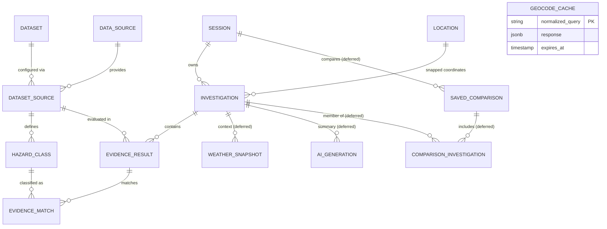

# HazardLens — Task-by-Task & Requirements Coverage Audit against SRS v3.1

**Document Version:** 2.3 (Reconciled Working Audit)  
**Audit Date:** 9 October 2026  
**Audited Commit:** `main` at [`3a50439`](https://github.com/Thesis-Titans/hazardlens/commit/3a50439)  
**Repository Path:** [`docs/audits/task-and-requirements-audit.md`](docs/audits/task-and-requirements-audit.md)  
**Pull Request:** [PR #29](https://github.com/Thesis-Titans/hazardlens/pull/29) (open and unmerged; peer review explicitly requested from `@vincenttamano`)  
**Document Status:** Working audit draft submitted for team review; formal baseline acceptance pending whole-team confirmation and Gate 0 closure.  
**Specification Reference:** System Requirements Specification v3.1 (working specification reference aligned with ISO/IEC/IEEE 29148:2018 principles; formal whole-team approval pending kickoff)  
**Governance Framework:** Section 8 Standard Issue Specification & Definition of Ready ([docs/agile-sprint-management-plan.md](../agile-sprint-management-plan.md))  
**Project Board:** [HazardLens — Sprint Board (Project #1)](https://github.com/orgs/Thesis-Titans/projects/1)  

---

## 1. Executive Evaluation & Evidential Framework

### Evidential Classifications
To eliminate ambiguity, every finding, record, and status metric in this audit is classified using strict evidential distinctions:

- **Reported:** A claim, log snippet, or metric recorded in tickets, PR summaries, or local developer workstations without independent reproduction attached. *Specifically, local `./scripts/verify.sh all` execution passes are classified as Reported until an independent clean-checkout reproduction is executed by a teammate and logged.*
- **Observed:** A live configuration, file state, or record directly inspected in GitHub or the active repository tree.
- **Verified:** A technical result reproduced hermetically through automated test suites or recorded test fixtures. For live external source queries, verification requires reproducible query records, offline mock/fixture replay, and recorded independent peer review (live source queries cannot themselves "pass offline").
- **Approved:** A technical, architectural, or scope decision formally confirmed by authorized team members (e.g. recorded kickoff meeting minutes, approved ADR, or formal gate closure).

### Requirements Evaluation Model
Rather than compressing multiple concepts into hybrid labels, requirements are audited across four separate, orthogonal dimensions:
1. **Specification:** Is the functional intent, boundary, and constraint documented without ambiguity? (`Specified` / `Needs Clarification`)
2. **Implementation:** What code exists in `main`? (`Not Started` / `Scaffold Only` / `Preview Slice Only` / `Delivered`)
3. **Verification:** Does reproducible acceptance evidence pass? (`Pending` / `Partial` / `Verified` / `Not Applicable Yet`)
4. **Scope Decision:** What is the approved or proposed release placement? (`MVP-required (Working Direction)` / `Proposed Post-MVP (Team Approval Pending)`)

### Working Baseline Assessment & Gate 0 Scope Boundary
> **Observed Assessment:** **Planning baseline substantially organized; final validation, whole-team confirmation, and Gate 0 closure pending.**
> 
> Standardized issue bodies and clean board configurations are valuable planning artifacts, but they do not prove that tasks are ready to execute or that the system is complete. Currently, only the FastAPI scaffold and the limited single-source MGB flood preview slice from PR #11 exist on `main`. Zero production multi-source orchestrators, PostGIS migrations, or final UI evidence components have been delivered.
> 
> **Explicit Scope Boundary During Gate 0:**
> - **Permitted Work:** Documentation corrections, issue specification refinements, planning and governance evidence collection, and peer reviews of documentation PRs (e.g. [PR #27](https://github.com/Thesis-Titans/hazardlens/pull/27) and [PR #29](https://github.com/Thesis-Titans/hazardlens/pull/29)) are actively permitted.
> - **Frozen Work:** Implementation of product features, hazard adapters, PostGIS migrations, and UI components remains **strictly paused** until Gate 0 ([Issue #12](https://github.com/Thesis-Titans/hazardlens/issues/12)) is formally closed with documented exit evidence.

---

## 2. Reconciled Governance & Tracking Actions

This version reflects the following confirmed repository and tracking reconciliations:

1. **PR #27 Status (README Scope Reconciliation):**
   - **Observed:** [PR #27](https://github.com/Thesis-Titans/hazardlens/pull/27) is **OPEN and unmerged** (head commit `78c973c`), based on `main` at `3a50439`. Requested reviewer is `@vincenttamano`.
   - **Scope:** Proposed README alignment with the proposed MVP matrix; awaiting independent peer review.
2. **PR #29 Status (Audit Baseline Publication):**
   - **Observed:** [PR #29](https://github.com/Thesis-Titans/hazardlens/pull/29) is **OPEN and unmerged**, based on `main` at `3a50439`.
   - **Action Taken:** Individual reviewer `@vincenttamano` explicitly requested via GitHub API. Remains unmerged pending peer review.
3. **Issue #1 Metadata Alignment:**
   - **Observed:** [Issue #1](https://github.com/Thesis-Titans/hazardlens/issues/1) title and labels aligned to `[Gate A] Review logical schema and define MVP PostGIS migration boundary` (`gate-a` label applied; `gate-b` removed). Body text clarifies that logical schema review begins in Gate A, while physical migration execution is staged.
4. **Decoupled Source Verification & Restored Paths (Issues #2 & #28):**
   - **[Issue #2](https://github.com/Thesis-Titans/hazardlens/issues/2):** Scoped strictly to Gate A / Task T1 (MGB Flood verification, repeatability, coverage rules, offline fixtures). Acceptance unblocks Gate B ([Issue #3](https://github.com/Thesis-Titans/hazardlens/issues/3)).
   - **[Issue #28](https://github.com/Thesis-Titans/hazardlens/issues/28):** Dedicated Gate C issue for Tasks T5 (MGB Landslide), T6 (PHIVOLCS Liquefaction), and T7 (PHIVOLCS Active Faults).
   - **Path Restoration Verified:** Verified that the live issue body renders the exact paths: `api/tests/fixtures/` and the relative link to `docs/source-verification-evidence-matrix.md`.
   - **Label Description Alignment:** `gate-c` description updated to *"Gate C — Remaining source contracts, orchestration & multi-source UI"* to encompass Issues #28, #6, and #8.
5. **Three Sequencing Concepts Disentangled:**
   - **Gate Acceptance:** Exit conditions that must be evidenced to declare a delivery gate closed (e.g. Gate A requires Task T1 verified).
   - **Issue Dependencies:** The technical deliverables that must exist before an issue can begin or close. For example, source verification in [Issue #28](https://github.com/Thesis-Titans/hazardlens/issues/28) depends on the Gate A methodology from #2, but can proceed independently of the [Issue #3](https://github.com/Thesis-Titans/hazardlens/issues/3) vertical slice UI. Gate C integration ([Issue #6](https://github.com/Thesis-Titans/hazardlens/issues/6)) depends on both #3 and #28.
   - **Provisional Sprint Horizons:** Planning fields on Project #1 (`Sprint 1` through `Sprint 4`) that provide a tentative forecast but do not authorize work, bypass gates, or establish committed calendar dates.
6. **Geocoding Working Proposal Language:**
   - Reconciled all geocoding provider mentions to "working proposal; final selection pending team approval" (Geoapify working proposal; public Nominatim fallback; Photon/PSGC exploratory).

---

## 3. Audit of 18 Active Delivery and Governance Issues

*Selection Rule: This table audits 100% of the active issues in the repository (18 of 18 open issues in `Thesis-Titans/hazardlens`: [#1](https://github.com/Thesis-Titans/hazardlens/issues/1)–[#8](https://github.com/Thesis-Titans/hazardlens/issues/8), [#12](https://github.com/Thesis-Titans/hazardlens/issues/12)–[#20](https://github.com/Thesis-Titans/hazardlens/issues/20), and [#28](https://github.com/Thesis-Titans/hazardlens/issues/28)). Rather than an asserted 1-to-1 correspondence with single engineering tasks, these 18 issues collectively track the project's delivery, governance, architecture, and verification work, with some issues grouping multiple related tasks.*

### Task-to-Issue Traceability Matrix (Tasks T1–T18 & Core Workstreams)

| Task / Workstream | Description | Gate | Tracking Issue | Grouping & Scope Summary |
|:---:|---|:---:|:---:|---|
| **T1** | MGB Flood source verification & repeatability | Gate A | **[#2](https://github.com/Thesis-Titans/hazardlens/issues/2)** | Dedicated single-source verification issue |
| **T2** | Investigation contract & response schema | Gate B | **[#3](https://github.com/Thesis-Titans/hazardlens/issues/3)** | Grouped under first vertical slice (Task T2 Contract) |
| **T3** | Investigation API & Evidence card UI | Gate B | **[#3](https://github.com/Thesis-Titans/hazardlens/issues/3)** | Grouped under first vertical slice (Tasks T3 API & T3 UI) |
| **T4** | Deterministic explanation logic | Gate B | **[#3](https://github.com/Thesis-Titans/hazardlens/issues/3)** | Grouped under first vertical slice (Task T4 Logic) |
| **T5** | MGB Landslide source contract & fixtures | Gate C | **[#28](https://github.com/Thesis-Titans/hazardlens/issues/28)** | Grouped under remaining official hazard sources |
| **T6** | PHIVOLCS Liquefaction contract & fixtures | Gate C | **[#28](https://github.com/Thesis-Titans/hazardlens/issues/28)** | Grouped under remaining official hazard sources |
| **T7** | PHIVOLCS Active Faults proximity buffer & fixtures | Gate C | **[#28](https://github.com/Thesis-Titans/hazardlens/issues/28)** | Grouped under remaining official hazard sources |
| **T8** | Multi-source concurrent orchestrator (bounded 10s) | Gate C | **[#6](https://github.com/Thesis-Titans/hazardlens/issues/6)** | Dedicated multi-source integration issue |
| **T9** | Evidence card UI with official classifications | Gate C | **[#8](https://github.com/Thesis-Titans/hazardlens/issues/8)** | Dedicated multi-source UI evidence card issue |
| **T10** | Philippine place search & coordinate fallback | Gate D | **[#7](https://github.com/Thesis-Titans/hazardlens/issues/7)** | Dedicated geocoding & fallback issue |
| **T11** | Current weather card with failure isolation | Gate D | **[#15](https://github.com/Thesis-Titans/hazardlens/issues/15)** | Dedicated weather integration issue |
| **T12** | Interactive map viewer (MapLibre) & picker | Gate D | **[#5](https://github.com/Thesis-Titans/hazardlens/issues/5)** | Dedicated map viewer & picker issue |
| **T13** | Anonymous session persistence & history | Gate D | **[#13](https://github.com/Thesis-Titans/hazardlens/issues/13)** | Dedicated session & investigation history issue |
| **T14** | Rate limits & privacy-safe diagnostics | Gate D | **[#17](https://github.com/Thesis-Titans/hazardlens/issues/17)** | Dedicated security & rate limiting issue |
| **T15** | Accessibility audit & cross-browser support | Gate D | **[#18](https://github.com/Thesis-Titans/hazardlens/issues/18)** | Dedicated WCAG & cross-browser issue |
| **T16** | Dataset extensibility verification spike | Gate D | **[#19](https://github.com/Thesis-Titans/hazardlens/issues/19)** | Dedicated NFR-09 measurable requirement issue |
| **T17** | AI provider spike & tool-calling evaluation | Post-MVP | **[#4](https://github.com/Thesis-Titans/hazardlens/issues/4)** | Dedicated AI evaluation spike issue |
| **T18** | Investigation comparison & printable report | Post-MVP | **[#14](https://github.com/Thesis-Titans/hazardlens/issues/14)** | Dedicated comparison & report issue |
| *Governance* | Planning, governance & delegation baseline | Gate 0 | **[#12](https://github.com/Thesis-Titans/hazardlens/issues/12)** | Dedicated Gate 0 closure issue |
| *Architecture* | Logical schema review & MVP migration boundary | Gate A | **[#1](https://github.com/Thesis-Titans/hazardlens/issues/1)** | Dedicated schema ADR & initial migration issue |
| *Spike* | Area polygon validation & capability gates | Post-MVP | **[#16](https://github.com/Thesis-Titans/hazardlens/issues/16)** | Dedicated polygon validation spike issue |
| *Verification*| Clean checkout reproduction & repository rules | Gate E | **[#20](https://github.com/Thesis-Titans/hazardlens/issues/20)** | Dedicated release verification issue |

---

### Audit of 18 Active Issues

| Issue | Standardized Title | Gate & Prov. Sprint | Mapped SRS Reqs | Proposed Delegation (Team Kickoff Confirmation Pending) | Issue Dependency & Readiness Status | Outstanding Refinements & Exit Criteria |
|:---:|---|:---:|---|---|:---:|---|
| **[#12](https://github.com/Thesis-Titans/hazardlens/issues/12)** | `[Gate 0] Close planning, governance, and delegation baseline` | **Gate 0**<br>Sprint 1 | Governance<br>NFR-11 | Lead: `@markalvincadangin`<br>Review: `@vincenttamano` | **Gate 0 Active**<br>(Blocks all downstream gates) | • Hold kickoff meeting to agree on sprint cadence, capacity, and roles.<br>• Confirm 2 pending organization invitations (`@Justin-Ardena` + 1).<br>• Verify live branch protection rules with GitHub administrator.<br>• Record clean-checkout reproduction by an independent teammate. |
| **[#1](https://github.com/Thesis-Titans/hazardlens/issues/1)** | `[Gate A] Review logical schema and define MVP PostGIS migration boundary` | **Gate A**<br>Sprint 1 | SRS §4.6<br>NFR-10, NFR-12 | Lead: `@vincenttamano`<br>Review: `@markalvincadangin` | **Gate A Staged**<br>(Blocked by Gate 0) | • Produce technical ADR documenting physical table types, constraints, and cascading rules for all 14 entities.<br>• Restrict initial Alembic migration to core MVP tables (9 tables), deferring comparison, polygon, and AI tables.<br>• Automated upgrade/downgrade test on clean PostGIS container. |
| **[#2](https://github.com/Thesis-Titans/hazardlens/issues/2)** | `[Gate A] Verify MGB Flood hazard source contract and repeatability (Task T1)` | **Gate A**<br>Sprint 1 | SRS §3, §7<br>FR-05, FR-06<br>NFR-02, NFR-07 | Lead: `@markalvincadangin`<br>Review: `@vincenttamano` | **Gate A Staged**<br>(Blocked by Gate 0) | • Capture fresh live-query evidence across independent sessions for MGB Flood.<br>• Establish source-supported coverage rule; unverified areas must return `UNAVAILABLE` rather than `NO_EVIDENCE`.<br>• Commit sanitized offline fixtures. Acceptance unblocks Gate B. |
| **[#3](https://github.com/Thesis-Titans/hazardlens/issues/3)** | `[Gate B] First vertical slice: investigation API and evidence card UI` | **Gate B**<br>Sprint 1 | FR-01, FR-03<br>FR-04, FR-07<br>FR-10, NFR-01 | T2 Contract: `@markalvin...` / `@vincent...`<br>T3 API: `@vincent...` / `@markalvin...`<br>T3 UI: `@Lovelly143` / `@faithbn`<br>T4 Logic: `@vincent...` / `@markalvin...` | **Gate B Staged**<br>(Blocked by Gate A / #2) | • Depends on verified MGB flood contract from #2.<br>• Coordinate input to rendered card workflow tested end-to-end.<br>• Enforce deterministic explanation algorithm without LLM dependency (T4).<br>• Persistence explicitly excluded from this first slice per PEP §4. |
| **[#28](https://github.com/Thesis-Titans/hazardlens/issues/28)** | `[Gate C] Verify remaining three official hazard sources (Tasks T5, T6, T7)` | **Gate C**<br>Sprint 2 | SRS §3, §7<br>FR-05, FR-06<br>NFR-02, NFR-07 | T5: `@markalvin...` / `@vincent...`<br>T6: `@vincent...` / `@markalvin...`<br>T7: `@Justin...` / `@markalvin...` | **Gate C Staged**<br>(Blocked by Gate 0 / #2; independent of #3 UI) | • Capture live query records and repeatability for MGB Landslide, PHIVOLCS Liquefaction, and Active Faults.<br>• Document active fault proximity buffer operations and distance semantics.<br>• Commit offline fixtures for all 3 layers. Unblocks #6. |
| **[#6](https://github.com/Thesis-Titans/hazardlens/issues/6)** | `[Gate C] Integrate verified official hazard data sources into orchestrator` | **Gate C**<br>Sprint 2 | FR-03, FR-05<br>FR-06, FR-09<br>NFR-01, NFR-02<br>NFR-03, NFR-09 | Lead: `@vincenttamano`<br>Review: `@markalvincadangin` | **Gate C Staged**<br>(Blocked by Gate B / #3 & #28) | • Concurrent query orchestrator under SRS default 10-second bounded deadline.<br>• Verify one source outage does not suppress findings from others.<br>• Preserve multiple matching features and differing source classifications verbatim. |
| **[#8](https://github.com/Thesis-Titans/hazardlens/issues/8)** | `[Gate C] Evidence card UI with official classifications and limitation notes` | **Gate C**<br>Sprint 2 | FR-04, FR-07<br>FR-08, FR-14<br>NFR-08 | Lead: `@Lovelly143`<br>Review: `@faithbn` | **Gate C Staged**<br>(Blocked by Gate B / #3) | • Render exact published classifications without synthetic risk scores.<br>• Distinct visual badges for all 5 statuses (`FOUND`, `NO_EVIDENCE`, `OUTSIDE_COVERAGE`, `UNAVAILABLE`, `UNSUPPORTED`).<br>• Visibly distinguish recorded fixtures from live results. |
| **[#5](https://github.com/Thesis-Titans/hazardlens/issues/5)** | `[Gate D] Interactive map viewer and coordinate picker fallback` | **Gate D**<br>Sprint 2 | FR-01, FR-02<br>FR-14, NFR-06 | Lead: `@Justin-Ardena`<br>Review: `@Lovelly143` | **Gate D Staged**<br>(Blocked by Gate B / #3) | • MapLibre canvas with pin-drop coordinate selection.<br>• Resilient fallback: evidence panel renders even if map tiles fail to load (FR-14).<br>• Confirm Justin's organization invitation is accepted. |
| **[#7](https://github.com/Thesis-Titans/hazardlens/issues/7)** | `[Gate D] Philippine place search with coordinate fallback` | **Gate D**<br>Sprint 2 | FR-01, FR-03<br>NFR-06 | Lead: `@markalvincadangin`<br>Review: `@vincenttamano` | **Gate D Staged**<br>(Blocked by Gate B / #3) | • Finalize geocoding provider selection (Geoapify working proposal awaiting team approval; public Nominatim fallback; Photon/PSGC exploratory).<br>• Enforce no client-side autocomplete policy.<br>• Seamless fallback to manual coordinates on geocoder error/timeout. |
| **[#13](https://github.com/Thesis-Titans/hazardlens/issues/13)** | `[Gate D] Investigation history and anonymous session persistence` | **Gate D**<br>Sprint 3 | FR-02, NFR-05<br>NFR-12, NFR-18 | Lead: `@vincenttamano`<br>Review: `@markalvincadangin` | **Gate D Staged**<br>(Blocked by Gate A & B) | • Cryptographically random HttpOnly cookie (SameSite=Lax).<br>• Strict cross-session isolation test (returns 404 on mismatched session ID).<br>• Zero raw client IPs stored or logged; 30-day expiry enforcement. |
| **[#15](https://github.com/Thesis-Titans/hazardlens/issues/15)** | `[Gate D] Weather card with independent failure isolation` | **Gate D**<br>Sprint 3 | FR-13, FR-21 | Lead: `@markalvin...` / `@Lovelly...`<br>Review: `@vincenttamano` | **Gate D Staged**<br>(Blocked by Gate B / #3) | • Proposed engineering target timeout for Open-Meteo query.<br>• Strict failure isolation: weather failure returns `UNAVAILABLE` without delaying or modifying hazard evidence (FR-21). |
| **[#17](https://github.com/Thesis-Titans/hazardlens/issues/17)** | `[Gate D] API rate limits and privacy-safe request diagnostics` | **Gate D**<br>Sprint 3 | NFR-04, NFR-13<br>NFR-18 | Lead: `@vincenttamano`<br>Review: `@markalvincadangin` | **Gate D Staged**<br>(Blocked by Gate C / #6) | • Rate limiting middleware returning HTTP 429 and `Retry-After`.<br>• Structured JSON diagnostics omitting secrets, live tokens, and raw IP addresses.<br>• Restrictive CORS configuration validated for deployment. |
| **[#18](https://github.com/Thesis-Titans/hazardlens/issues/18)** | `[Gate D] Accessibility and supported-browser acceptance checks` | **Gate D**<br>Sprint 3 | NFR-16, NFR-17 | Lead: `@faithbn`<br>Review: `@Lovelly143` | **Gate D Staged**<br>(Blocked by Gate D UI) | • Keyboard navigation audit without focus traps.<br>• ARIA live regions for async evidence loading; WCAG 2.2 AA contrast checks.<br>• Responsive testing on Chrome, Firefox, Edge, and mobile viewports. |
| **[#19](https://github.com/Thesis-Titans/hazardlens/issues/19)** | `[Gate D] Clarify NFR-09 dataset extensibility as a measurable requirement` | **Gate D**<br>Sprint 3 | NFR-09 | Lead: `@markalvincadangin`<br>Review: `@vincenttamano` | **Gate D Staged**<br>(Blocked by Gate C / #6) | • Register mock compatible dataset via adapter class + registry row.<br>• Execute query through normal orchestrator asserting normalized output without requiring an Alembic migration. |
| **[#20](https://github.com/Thesis-Titans/hazardlens/issues/20)** | `[Gate E] Reproduce clean-checkout setup and verify repository rules` | **Gate E**<br>Sprint 3 | Gate E<br>NFR-10, §7 | Lead: `@faithbn` / `@markalvin...`<br>Review: `@vincent...` / `@Lovelly...` | **Gate E Staged**<br>(Blocked by all MVP Tasks) | • Teammate clean clone reproduction, Docker Compose startup, `./scripts/verify.sh all` execution, and terminal logging.<br>• Requirements traceability matrix links verified evidence to all MVP requirements. |
| **[#4](https://github.com/Thesis-Titans/hazardlens/issues/4)** | `[Post-MVP] AI provider evaluation and tool-calling spike` | **Post-MVP**<br>Sprint 4 | FR-15–FR-19<br>NFR-14, NFR-15 | Lead: `@markalvincadangin`<br>Review: `@vincenttamano` | **Deferred**<br>(Proposed Post-MVP; gated behind core evidence) | • Strictly gated behind Gates B and C.<br>• Pydantic schema validation for structured outputs; bounded tool allow-list (max 5 calls); deterministic fallback on timeout/failure. |
| **[#14](https://github.com/Thesis-Titans/hazardlens/issues/14)** | `[Post-MVP] Investigation comparison and printable evidence report` | **Post-MVP**<br>Sprint 4 | FR-11, FR-12 | Lead: `@Lovelly143` / `@faithbn`<br>Review: `@markalvincadangin` | **Deferred**<br>(Proposed Post-MVP) | • Side-by-side comparison without universal scoring.<br>• Print layout (`@media print`) with official attribution, watermarking, and source dates. Does not block MVP. |
| **[#16](https://github.com/Thesis-Titans/hazardlens/issues/16)** | `[Post-MVP] Area investigation polygon validation and source capability gates` | **Post-MVP**<br>Sprint 4 | FR-20 | Lead: `@markalvincadangin`<br>Review: `@vincenttamano` | **Deferred**<br>(Proposed Post-MVP) | • Geometry validation for simple convex/concave polygons; rejects self-intersecting or oversized geometries; returns `UNSUPPORTED` for point-only layers. |

---

## 4. Multi-Column Requirements Coverage Audit against SRS v3.1

### Functional Requirements (FR-01 to FR-21)

| Requirement | Short Intent | Specification | Implementation | Verification | Scope Decision |
|---|---|:---:|:---:|:---:|---|
| **FR-01** | Location selection via search or map; coordinate rounding | Specified | Preview slice only (rounds coordinates) | Pending (place search & map tests outstanding) | MVP-required (Working Direction) |
| **FR-02** | Investigation persistence and session history | Specified | Not started | Pending (PostGIS migration & history tests outstanding) | MVP-required (Working Direction) |
| **FR-03** | Concurrent multi-dataset query under 10s deadline | Specified | Preview slice only (single source) | Pending (concurrent orchestrator & timeout tests outstanding) | MVP-required (Working Direction) |
| **FR-04** | Every evidence result uses exactly one of five statuses | Specified | Preview slice only (schema defines 5 statuses) | Partial (flood preview verified; multi-source tests pending) | MVP-required (Working Direction) |
| **FR-05** | `NO_EVIDENCE` only after query inside verified coverage | Specified | Preview slice only (empty maps to `UNAVAILABLE`) | Partial (flood offshore fixture captured; coverage rules pending) | MVP-required (Working Direction) |
| **FR-06** | Geometry-appropriate spatial operations (point, fault distance) | Specified | Preview slice only (point-in-polygon) | Pending (active fault buffer & distance tests outstanding) | MVP-required (Working Direction) |
| **FR-07** | Provenance display: agency, layer, source date, retrieval time | Specified | Preview slice only (provenance metadata fields) | Partial (preview schema verified; UI metadata display pending) | MVP-required (Working Direction) |
| **FR-08** | Preserve published classifications verbatim; no universal score | Specified | Preview slice only (preserves MGB labels) | Partial (preview asserts source labels; UI score absence pending) | MVP-required (Working Direction) |
| **FR-09** | Preserve multiple material matches and display disagreements | Specified | Preview slice only (feature list supported) | Pending (multi-hazard intersection test outstanding) | MVP-required (Working Direction) |
| **FR-10** | Deterministic plain-language explanation without LLM | Specified | Preview slice only (summary field) | Partial (rule-based algorithm specified; full dictionary test pending) | MVP-required (Working Direction) |
| **FR-11** | Side-by-side comparison of past investigations | Specified | Not started | Not applicable yet | Proposed Post-MVP (Team Approval Pending) |
| **FR-12** | Printable hazard briefing summary with watermarking | Specified | Not started | Not applicable yet | Proposed Post-MVP (Team Approval Pending) |
| **FR-13** | Current weather card separate from hazard evidence | Specified | Not started | Pending (Open-Meteo adapter & UI card tests outstanding) | MVP-required (Working Direction) |
| **FR-14** | Evidence panel functions if map tiles or geocoder fail | Specified | Not started | Pending (graceful degradation offline UI test outstanding) | MVP-required (Working Direction) |
| **FR-15** | AI explanation consumes only structured evidence | Specified | Not started | Not applicable yet (gated behind core evidence) | Proposed Post-MVP (Team Approval Pending) |
| **FR-16** | AI chat grounded in current investigation; refuses unsupported queries | Specified | Not started | Not applicable yet (gated behind core evidence) | Proposed Post-MVP (Team Approval Pending) |
| **FR-17** | Natural-language lookup bounded by allow-listed tool calls (max 5) | Specified | Not started | Not applicable yet (gated behind core evidence) | Proposed Post-MVP (Team Approval Pending) |
| **FR-18** | Visual "AI Generated" badge; store model, prompt version, hash | Specified | Not started | Not applicable yet (gated behind core evidence) | Proposed Post-MVP (Team Approval Pending) |
| **FR-19** | AI provider failure falls back seamlessly to deterministic summary | Specified | Not started | Not applicable yet (gated behind core evidence) | Proposed Post-MVP (Team Approval Pending) |
| **FR-20** | Simple area polygon validation with configurable size limit | Specified | Not started | Not applicable yet | Proposed Post-MVP (Team Approval Pending) |
| **FR-21** | Weather failure returns `UNAVAILABLE` without impacting hazard results | Specified | Not started | Pending (weather 500 error mock isolation test outstanding) | MVP-required (Working Direction) |

---

### Non-Functional Requirements (NFR-01 to NFR-18)

| Requirement | Short Intent | Specification | Implementation | Verification | Scope Decision |
|---|---|:---:|:---:|:---:|---|
| **NFR-01** | Cached lookup < 1s; live query bounded by deadline | Specified | Preview slice only (bounded timeout) | Pending (latency benchmark test outstanding) | MVP-required (Working Direction) |
| **NFR-02** | Upstream timeout + 1 retry on 5xx/timeout; no retry on 4xx | Specified | Preview slice only (retry transport in preview client) | Partial (flood preview verified; remaining 3 sources pending) | MVP-required (Working Direction) |
| **NFR-03** | Upstream URLs from server configuration; no client-supplied URLs | Specified | Preview slice only (configured in adapter) | Partial (flood preview verified; remaining adapters pending) | MVP-required (Working Direction) |
| **NFR-04** | Restrictive CORS; AI API keys remain server-side | Specified | Scaffold only (middleware in `main.py`) | Partial (local CORS passes; production origin audit pending) | MVP-required (Working Direction) |
| **NFR-05** | Cryptographically random HttpOnly cookie; zero raw client IPs | Specified | Not started | Pending (cookie entropy & log audit tests outstanding) | MVP-required (Working Direction) |
| **NFR-06** | Geocoding policy compliance; no public Nominatim autocomplete | Specified | Not started | Pending (explicit search submission test outstanding) | MVP-required (Working Direction) |
| **NFR-07** | Recorded demo fixtures for Iloilo points; labelled as recorded | Specified | Preview slice only (2 flood fixtures committed) | Partial (flood fixtures verified; remaining 3 sources pending) | MVP-required (Working Direction) |
| **NFR-08** | Attribution and planning-data disclaimer banner on every page | Specified | Scaffold only (banner draft) | Pending (UI inspection across all pages outstanding) | MVP-required (Working Direction) |
| **NFR-09** | Compatible dataset extensible via adapter + registry row without migration | Specified | Not started | Pending (mock adapter registration test outstanding) | MVP-required (Working Direction) |
| **NFR-10** | Hermetic dependency pinning; shared API contracts | Specified | Scaffold only (pinned in lockfiles) | Partial (lockfiles pass verify.sh; TypeScript export pending) | MVP-required (Working Direction) |
| **NFR-11** | Strictly no scraping, framing, or embedding of HazardHunterPH | Specified | Scaffold only (policy codified in `AGENTS.md`) | Partial (codified in AGENTS.md; reproducible grep test & independent review pending) | MVP-required (Working Direction) |
| **NFR-12** | Strict cross-session isolation; cannot access others' investigations | Specified | Not started | Pending (cross-session 404 security test outstanding) | MVP-required (Working Direction) |
| **NFR-13** | Rate limits on expensive endpoints; HTTP 429 on exhaustion | Specified | Not started | Pending (burst request rate-limit test outstanding) | MVP-required (Working Direction) |
| **NFR-14** | AI timeouts and fallback on transport/model error | Specified | Not started | Not applicable yet (gated behind core evidence) | Proposed Post-MVP (Team Approval Pending) |
| **NFR-15** | Prompt injection defenses; source attributes treated as untrusted | Specified | Not started | Not applicable yet (gated behind core evidence) | Proposed Post-MVP (Team Approval Pending) |
| **NFR-16** | WCAG 2.2 AA accessibility; keyboard-only navigation; no focus traps | Specified | Not started | Pending (Axe-core scan & keyboard audit log outstanding) | MVP-required (Working Direction) |
| **NFR-17** | Cross-browser support (Chrome, Firefox, Edge) and mobile viewports | Specified | Not started | Pending (responsive screenshot captures outstanding) | MVP-required (Working Direction) |
| **NFR-18** | Structured diagnostic logs omitting raw IPs and secrets | Specified | Not started | Pending (log regex audit for IPs and tokens outstanding) | MVP-required (Working Direction) |

---

## 5. Proposed Logical Schema and Initial Migration Boundary

### Logical Architecture Reference & Status
- **Logical Architecture Reference:** The 14-entity logical model in SRS §4.6 is the complete data architecture inventory to reconcile against.
- **Proposed Migration Boundary:** The nine-table initial migration is the proposed core MVP boundary.
- **Pending Engineering Artifacts:** Exact SQL column types, spatial SRIDs, primary/foreign key constraints, composite indexes, cascading deletion rules, and the final migration scripts remain pending the technical schema ADR, independent review, and automated migration tests in [Issue #1](https://github.com/Thesis-Titans/hazardlens/issues/1).
- **Physical Delivery Status:** No physical migration should be described as delivered until the migration scripts exist in the repository, execute cleanly against PostGIS, and have been verified via automated test suites.



*(Note: `GEOCODE_CACHE` is an independent query cache table without foreign-key dependencies to the `session` or `investigation` entity hierarchies; its records expire after 30 days under NFR-06).*

### Proposed Core MVP Migration Boundary (9 Tables)
The initial Alembic migration in [Issue #1](https://github.com/Thesis-Titans/hazardlens/issues/1) proposes creating only the 9 relational entities required for core investigation persistence:
1. `dataset`: Registry of canonical hazard themes (`key`, `name`, `description`).
2. `data_source`: Agency registry (`agency`, `attribution`, `terms_url`).
3. `dataset_source`: Specific endpoint/layer configuration (`access_path`, `base_url`, `layer`, `extent`, `priority`, `active`).
4. `hazard_class`: Source-published classifications (`code`, `label`, `definition_text`).
5. `location`: Optional spatial geography point with 5-decimal snapped coordinates (EPSG:4326).
6. `session`: Anonymous session identifier with 30-day expiry (`id`, `created_at`, `expires_at`).
7. `investigation`: Session-owned query record (`geometry`, `selection_type`, `created_at`, `duration_ms`).
8. `evidence_result`: Per-source query result with status enum and provenance (`status`, `retrieved_at`, `latency_ms`, `raw` JSONB).
9. `evidence_match`: Individual feature matches linking `evidence_result` to `hazard_class` (`distance_band_m`).

### Deferred Feature Migrations
- `weather_snapshot`: Migrated during Gate D with Task T11 ([Issue #15](https://github.com/Thesis-Titans/hazardlens/issues/15)).
- `geocode_cache`: Migrated during Gate D with Task T10 ([Issue #7](https://github.com/Thesis-Titans/hazardlens/issues/7)).
- `saved_comparison` & `comparison_investigation`: Migrated during Post-MVP with Task T18 ([Issue #14](https://github.com/Thesis-Titans/hazardlens/issues/14)).
- `ai_generation`: Migrated during Post-MVP with Task T17 ([Issue #4](https://github.com/Thesis-Titans/hazardlens/issues/4)).

---

## 6. Actionable Gate 0 Closure Checklist

Gate 0 must not be closed on assumptions. The following five evidentiary steps are required before Issue [#12](https://github.com/Thesis-Titans/hazardlens/issues/12) is closed and Gate A begins:

- [ ] **1. Independent Review & Merge of [PR #27](https://github.com/Thesis-Titans/hazardlens/pull/27):**  
  Teammate `@vincenttamano` reviews and approves PR #27; PR is merged into `main` to align README scope presentation with the proposed MVP matrix.
- [ ] **2. Team Kickoff Meeting Conducted & Minutes Recorded:**  
  Whole team (`@markalvincadangin`, `@vincenttamano`, `@Lovelly143`, `@faithbn`, `@Justin-Ardena`) reviews and records:
  - Proposed MVP vs. Post-MVP scope classifications (FR-11, FR-12, FR-20 deferred; FR-13, FR-21 in MVP; AI layer gated behind core evidence).
  - Agile delivery cadence, actual student capacity, and review pairings.
  - Geocoding provider working proposal (Geoapify working proposal awaiting team approval; public Nominatim fallback; terms recorded in DEC-20).
- [ ] **3. Organization Invitations Accepted:**  
  Confirm `@Justin-Ardena` and the remaining collaborator accept write invitations on `Thesis-Titans`. Verify native GitHub assignees match the delegation matrix.
- [ ] **4. Branch Protection Rules Verified:**  
  Repository administrator verifies that `main` branch protection requires 1 PR review and passing CI (`CI/backend` and `CI/frontend`).
- [ ] **5. Independent Clean-Checkout Reproduction:**  
  An independent teammate (e.g. `@vincenttamano` or `@faithbn`) clones fresh from `main`, executes `./scripts/verify.sh all`, and logs successful execution on Issue [#12](https://github.com/Thesis-Titans/hazardlens/issues/12).

---

## 7. Immediate Execution Sequence Upon Gate 0 Closure

```text
[ Gate 0 Formally Closed ]
             │
             ├──► Pull Issue #2 (Gate A: Task T1 MGB Flood Verification) ──► Mark (Lead), Vincent (Reviewer)
             │
             └──► Pull Issue #1 (Gate A: Schema ADR & 9-Table Migration) ──► Vincent (Lead), Mark (Reviewer)
```
